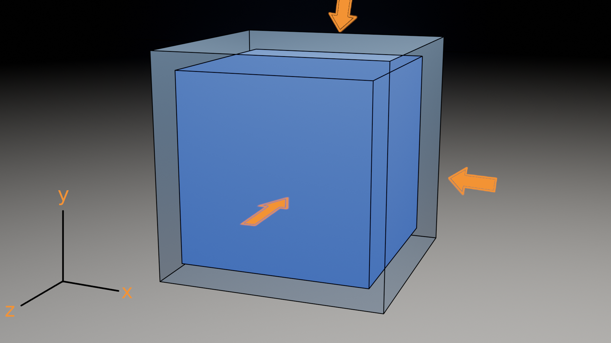
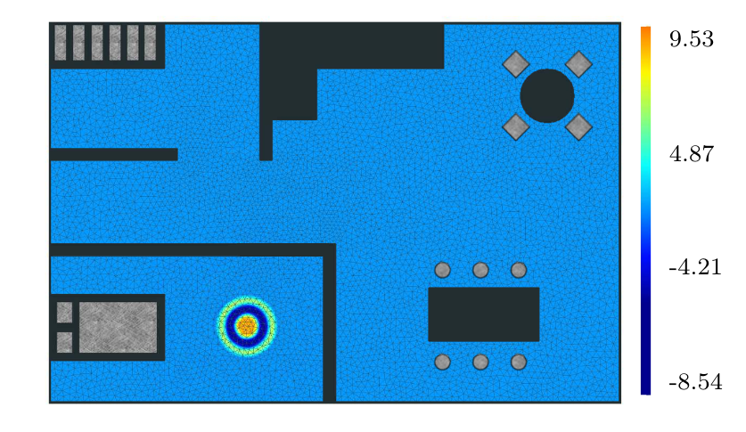
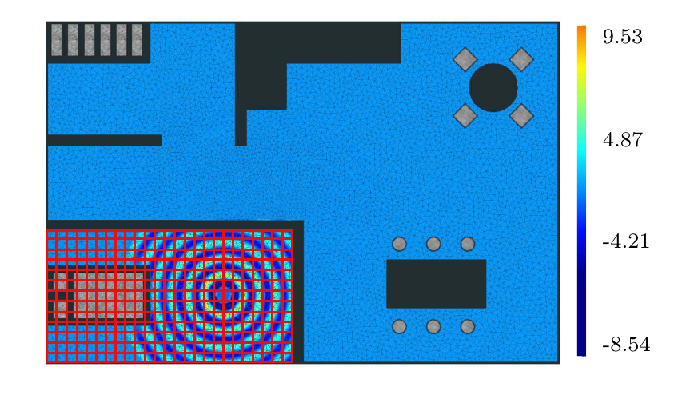
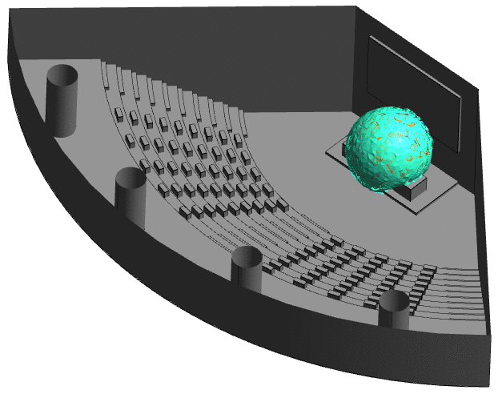
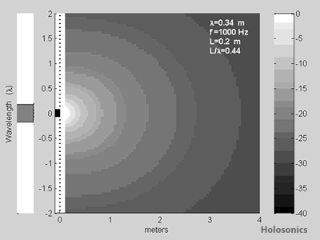
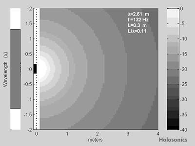
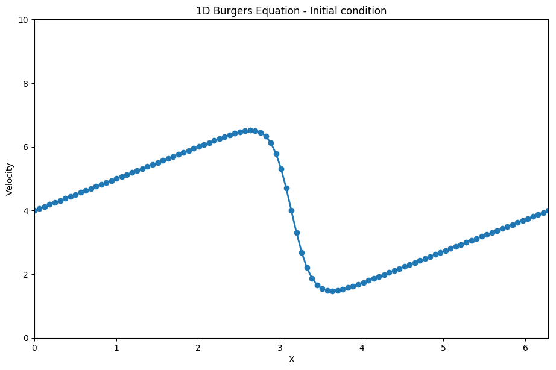
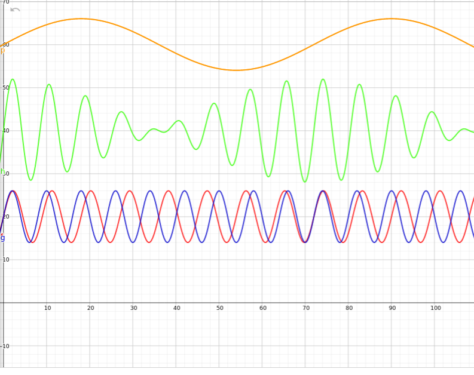
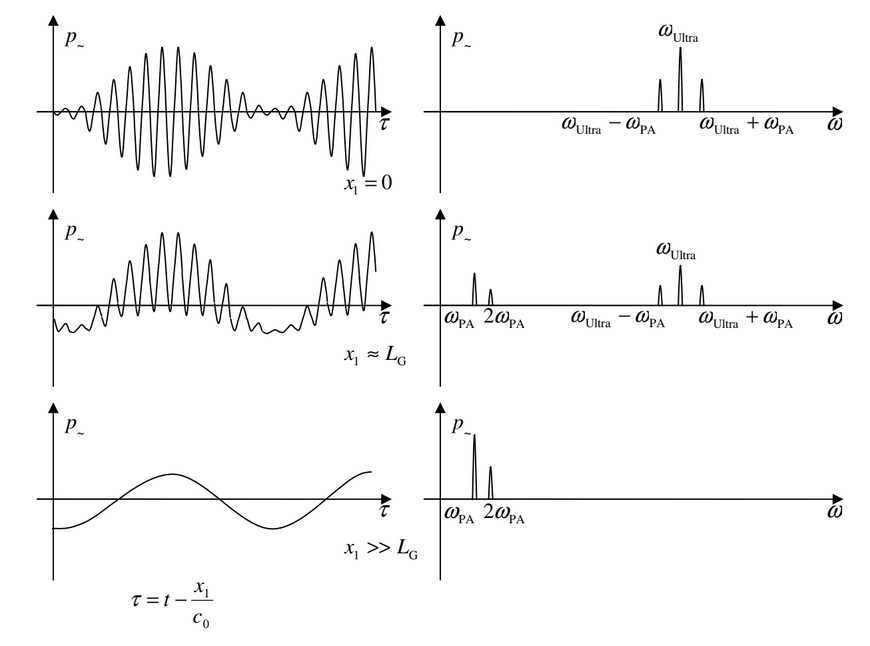
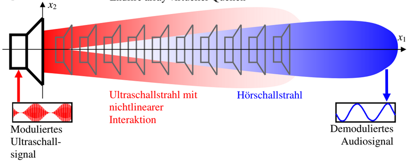

#+MACRO: color @@html:<b>$2</b>@@
#+OPTIONS:  num:nil 
#+REVEAL_THEME: moon
#+LATEX_HEADER: \usepackage{xcolor} 
#+OPTIONS: toc:nil 
#+REVEAL_TITLE_SLIDE: <h2>%t</h2>
&nbsp;
<h3>%s</h3>
&nbsp;
<h4>%A %a</h4>
#+Title: Anwendung von nichtlinearer Akustik für Ultraschall
#+Subtitle: Kolloquium
#+Author: Christoph-Alexander Hermanns 
#+Email: hermannschris@googlemail.com
#+REVEAL_TITLE_SLIDE_BACKGROUND_OPACITY: 0.00001
#+REVEAL_TITLE_SLIDE_BACKGROUND: ./img/Technik.png
#+REVEAL_TITLE_SLIDE_BACKGROUND_SIZE: 400px
#+REVEAL_TITLE_SLIDE_BACKGROUND_POSITION: top +15px left +15px
* Schall
  Schall ist das Resultat einer sich durch ein Medium periodisch ausbreitenden Störung.
  
  Die Störung wird durch die mechanische Verschiebung der Teilchen des Mediums verursacht.

  Dieses Phänomen wird als Schallwelle charakterisiert.
* Bewegung im Medium
 #+ATTR_ORG: :width 200px :height 200px
 #+ATTR_HTML:  image :title Teilchenbewegung bei Schallwelle :align center :width 80% :height 80%
 [[./img/partwave.gif]] \\

** Oszillierende Bewegung
  @@html:<video width="100%" height="100%" controls> <source src="./Video/sinusoid.webm" type="video/webm"> <video/>@@

* Schall - Einteilung nach Frequenz
 #+ATTR_ORG: :width 200px :height 200px
 #+ATTR_HTML:  image :title Schalleinteilung nach Frequenz im Raum :align center :width 90% :height 90%
 [[./img/schall_frequency.jpg]] \\

  Abhängig von der Frequzenz wird Schall eingeteilt: \\

  {{{color(white, Infraschall: )}}} 
  unter 16 Hz: Waschmaschinen, Heizungen \\
 
  {{{color(white, Hörbarer Schall: )}}}
  16 Hz - 20 kHz: Sprache, Musik\\
  
  {{{color(white, Ultraschall: )}}}
  über 16 kHz: Delfine, Feldermäuse - Echoortung\\
* Zustandsübergänge des Mediums
 #+ATTR_ORG: :width 200px :height 200px
 #+ATTR_HTML:  image :title Teilchenbewegung bei Schallwelle :align center :width 80% :height 80%
  \\
  Medium ist Kompressibel.
 

** Verlauf der Zustandsänderungen
  #+ATTR_ORG: :width 200px :height 200px
  #+ATTR_HTML:  image :title Linear Druck-Dichte :align center :width 40% :height 40%
  [[./img/prholinear.png]]\\
  Aussagenmaß der{{{color(white, Schallgeschwindigkeit)}}}
  
* Kontinuität im Medium
  Systemgrößen Druck, Dichte und Geschwindigkeit der Bewegung
  bleiben erhalten.
** Bildung der Schallwelle im Raum
  #+ATTR_ORG: :width 200px :height 200px
  #+ATTR_HTML:  image :title Schallwellenbildung im Raum :align center :width 80% :height 80%
   \\
  
** Ausbreitung der Schallwelle
  #+ATTR_ORG: :width 200px :height 200px
  #+ATTR_HTML:  image :title Schallausbreitung im Raum :align center :width 80% :height 80%
   \\

* Kurzzusammenfassung
  \\
  {{{color(white, Bewegung)}}} im Medium\\
  \\
  {{{color(white, Kontinuität)}}} des Mediums\\
  \\
  {{{color(white, Zustände)}}} des Mediums\\

* Technische Anwendung von Schall
** Lautsprecher - Richtcharakteristik
   #+REVEAL:split
   #+ATTR_ORG: :width 200px :height 200px
   #+ATTR_HTML:  image :title Lautsprecher Kugelwelle :align center :width 70% :height 70%
  Schall niedriger Frequenz: \\
  [[./Video/audibleLoud.gif]] \\
  Ein Lautsprecher mit schwacher Richtcharakteristik.
#+REVEAL:split
 #+ATTR_ORG: :width 200px :height 200px
 #+ATTR_HTML:  image :title Ausbreitung Kugelwelle :align center :width 60% :height 60%
    \\
 Die Ausbreitung von hörbaren Schall.

*** Änderung der Fläche
   #+ATTR_ORG: :width 200px :height 200px
   #+ATTR_HTML:  image :title Änderung der Wellenlänge :align center :width 70% :height 70%
    \\

*** Änderung der Frequenz
   #+ATTR_ORG: :width 200px :height 200px
   #+ATTR_HTML:  image :title Änderung der Schallfläche :align center :width 70% :height 70%
    \\
  
#+REVEAL:split 
   #+ATTR_ORG: :width 200px :height 200px
   #+ATTR_HTML:  image :title Hohe Frequenz Lautsprecher :align center :width 70% :height 70%
   Schall hoher Frequenz: \\
   [[./Video/DirectedLoud.gif]] \\
  Ein Lautsprecher mit starker Richtcharakteristik. 

* Besonderheit des Mediums Luft
  Starke Dämpfung hoher Frequenzen. \\
  Übergänge der Zustände sind {{{color(white, nichtlinear)}}}. \\
  #+REVEAL:split 
   #+ATTR_ORG: :width 200px :height 200px
   #+ATTR_HTML:  image :title Verlauf Druck-Dichte real :align center :width 50% :height 50%
   [[./img/prho.png]] \\
   Nichtlineare Übergänge der Zustände.
  #+REVEAL:split
   #+ATTR_ORG: :width 200px :height 200px
   #+ATTR_HTML:  image :title Ausbreitungsgeschwindigkeit - nichtlinear :align center :width 60% :height 60%
   \\
  Entwickelte Funktion der Bewegungsgeschwindigkeit. \\
  Höhere Harmonische im Schwingung.
 
 
* Anwendung für Ultraschall 
  Hohe Frequenzen (Ultraschall) - starke Richtcharakteristik. \\
  \\
  Hohe Energie bei der Ausbreitung in Luft. \\
  \\
  {{{color(white, Konsequenz:)}}} \\ 
  Nichtlinearität liegt nutzbaren Anwendungen zugrunde. \\

** Ultraschall zu Hörschall
   Amplituden Modulation wandelt Ultraschallfrequenzen zu hörbaren Schall. \\
*** Prinzip der Amplituden Modulation
  #+ATTR_ORG: :width 200px :height 200px
  #+ATTR_HTML:  image :title Amplituden Modulation der Signale :align center :width 60% :height 60%
   \\
  Bildung der hörbaren Differenzfrequenz.\\
#+REVEAL:split  
  #+ATTR_ORG: :width 200px :height 200px
  #+ATTR_HTML:  image :title Demodulation des Signals :align center :width 60% :height 60%
   \\
  Einflüsse durch hochfrequente Komponenten verschwinden. \\
  Das Signal wird geglättet - bzw. demoduliert. \\
#+REVEAL:split
  #+ATTR_ORG: :width 200px :height 200px
  #+ATTR_HTML:  image :title Virtuelle Schallquelle :align center :width 70% :height 70%
   \\
  Hörbarer Schall entsteht nicht an der mechanischen Quelle, sondern nach einiger Distanz in der Luft. \\
* Fazit
  Die Nichtlinearität der Luft kann genutzt werden
  um Frequenzen aus dem Ultraschallbereich
  für *besondere* hörakustische Anwendungen nutzbar zu machen.\\
  \\
  
* Danke für die Aufmerksamkeit
  #+ATTR_ORG: :width 200px :height 200px
  #+ATTR_HTML:  image :title Museum Holosonic-Lautsprecher :align center :width 70% :height 70%
  [[./img/HolosonicSolution.png]]
** Weiterführende Links
[[https://github.com/pvanberg/DGFEM-Acoustic][Framework für Schallausbreitung]] \\
[[https://www.egr.msu.edu/~fultras-web/][Matlab-plugin für Ultraschall]] \\
[[https://www.holosonics.com/][Hersteller von Richt-Lautsprechern]] \\

Bei weiteren Fragen: \\
hermannschris@googlemail.com
