#+MACRO: color @@html:<b>$2</b>@@
#+OPTIONS:  num:nil 
#+REVEAL_THEME: league
#+LATEX_HEADER: \usepackage{xcolor} 
#+OPTIONS: toc:nil 
#+REVEAL_TITLE_SLIDE: <h2>%t</h2>
&nbsp;
<h3>%s</h3>
&nbsp;
<h4>%A %a</h4>
#+Title: Anwendung von nichtlinearer Akustik für Ultraschall
#+Subtitle: Kolloquium
#+Author: Christoph-Alexander Hermanns 
#+Email: hermannschris@googlemail.com
#+REVEAL_TITLE_SLIDE_BACKGROUND_OPACITY: 0.00001
#+REVEAL_TITLE_SLIDE_BACKGROUND: ./img/Technik.png
#+REVEAL_TITLE_SLIDE_BACKGROUND_SIZE: 400px
#+REVEAL_TITLE_SLIDE_BACKGROUND_POSITION: top +15px left +15px
* Motivation
  Verständnis der nichtlinearen Interaktion beim parametrischen Array. \\
  #+ATTR_REVEAL: :frag roll-in 
  #+ATTR_ORG: :width 200px :height 200px
  #+ATTR_HTML:  image :title Verlauf Druck-Dichte real :align top-right :width 30% :height 30%
   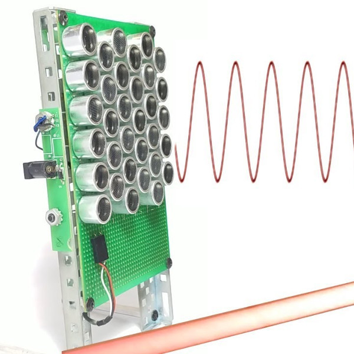
  #+ATTR_REVEAL: :frag roll-in
  Ultraschallschwingungen zu hörbaren Schall.
* Schall
  Schall ist das Resultat einer sich durch ein Medium periodisch ausbreitenden Störung.
  
  Die Störung wird durch die mechanische Verschiebung der Teilchen des Mediums verursacht.

  Dieses Phänomen wird als Schallwelle charakterisiert.

** Bewegung im Medium  Luft
  
  Schall breitet sich als Kompressionwelle aus.
  /Praktisches Beispiel/

** Schall - Einteilung nach Frequenz
 #+ATTR_ORG: :width 200px :height 200px
 #+ATTR_HTML:  image :title Schalleinteilung nach Frequenz im Raum :align center :width 90% :height 90%
 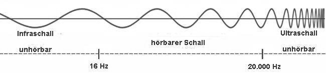 \\

  Abhängig von der Frequzenz wird Schall eingeteilt: \\

  {{{color(white, Infraschall: )}}} 
  unter 16 Hz: Waschmaschinen, Heizungen \\
 
  {{{color(white, Hörbarer Schall: )}}}
  16 Hz - 20 kHz: Sprache, Musik\\
  
  {{{color(white, Ultraschall: )}}}
  über 16 kHz: Delfine, Feldermäuse - Echoortung\\
* Die Lineare Akustik
   #+ATTR_ORG: :width 200px :height 200px
   #+ATTR_HTML:  image :title Verlauf Druck-Dichte real :align center :width 30% :height 30%
   Druck und Dichte verhalten zueinander linear.
  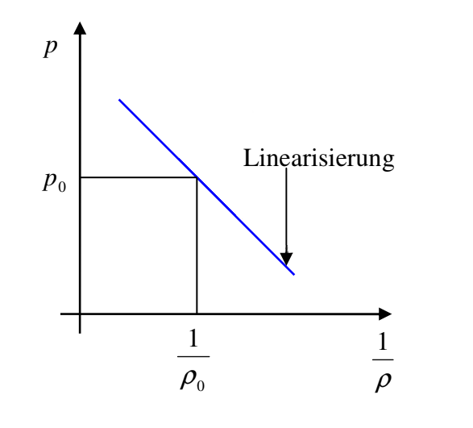 \\
  Schallgeschwindigkeit als Charakteristik: \\
 
   $c_0^2 = \frac{\partial{p}}{\partial{\rho}}$ , Luft $c_0 \approx 343 \frac{m}{s}$
  
** Gleichungen der linearen Akustik
   Beschreibung der Vorgänge im Medium
   - Zustandsgleichung: $p = p_0 + \left(\frac{\partial p}{\partial \rho}\right) \cdot(\rho - \rho_0)$
   - Kontinuitätsgleichung: - $\nabla(\rho \cdot v) = \frac{\partial\rho}{\partial t}$ \\
  
   - Bewegungsgleichung: $\rho v_t = -\nabla p$
*** Gültige Funktion der Gleichungen
    #+ATTR_ORG: :width 200px :height 200px
   #+ATTR_HTML:  image :title Verlauf Druck-Dichte real :align center :width 60% :height 60%
      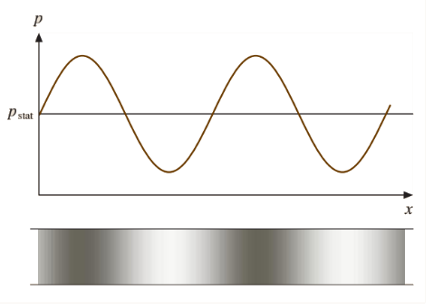 \\
      $p(x) =   \psi sin(x)$ \\
      $p(t) = \psi sin(t)$
      
** Anwendung: Superpositionsprinzip
  Wellen überlagern sich ungestört. 

  Die Schwebung ist Beispiel einer Superposition.

** Die Schwebung
   #+ATTR_ORG: :width 200px :height 200px
   #+ATTR_HTML:  image :title Die Schwebung :align center :width 60% :height 60%
   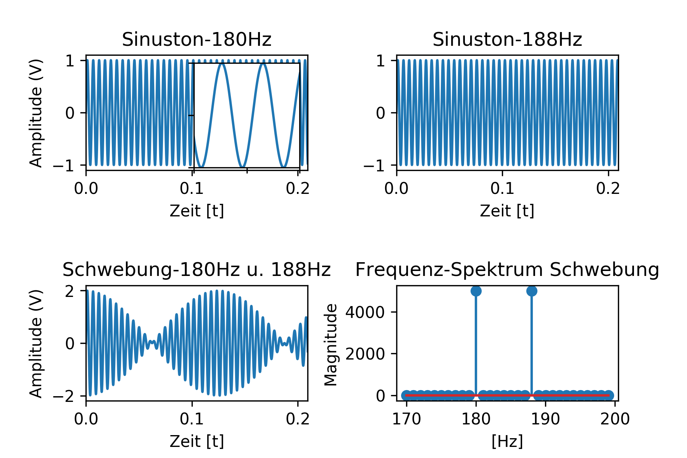
   @@html: @@
   @@html:<audio controls><source src="./audio/180hz.webm" type="audio/webm"> </audio> 
   <audio controls><source src="./audio/188hz.webm" type="audio/webm"> </audio> 
   <audio controls><source src="./audio/180u188hz.webm" type="audio/webm"> </audio> @@
#+REVEAL:split
  Keine Erzeugung von neuen Frequenzen. :(

* Die Nichtlineare Akustik
  Starke Dämpfung hoher Frequenzen. \\
  Übergänge der Zustände sind {{{color(white, nichtlinear)}}}. \\
** Zustandsübergänge in der Luft
   #+ATTR_ORG: :width 200px :height 200px
   #+ATTR_HTML:  image :title Verlauf Druck-Dichte real :align center :width 30% :height 30%
   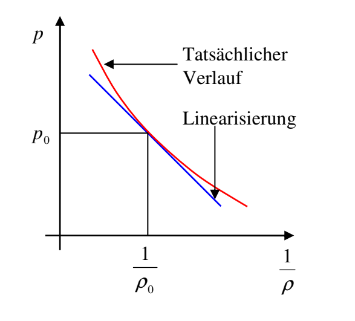 \\
  Erweiterung der Zustandsgleichung:  $p = p_0 + \left(\frac{\partial p}{\partial \rho}\right) \cdot(\rho - \rho_0) {\color{red}+}\frac{1}{2}\left(\frac{\partial^2p}{\partial \rho^2}\right)\cdot(\rho- \rho)^2$
** Begrenzt gültige Funktion
   #+ATTR_ORG: :width 200px :height 200px
   #+ATTR_HTML:  image :title Geschwindigkeitszunahme :align center :width 40% :height 40%
   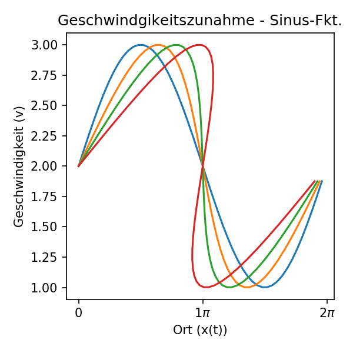 \\
   $u(x,t) =  sin(x -ut)$ und. $x(t)$ \\
   blau: $t_0$ ... \\
   rot: $t_{end}$
** Erzeugung von zusätzlichen Harmonischen
   #+ATTR_ORG: :width 200px :height 200px
   #+ATTR_HTML:  image :title Ausbreitungsgeschwindigkeit - nichtlinear :align center :width 60% :height 60%
   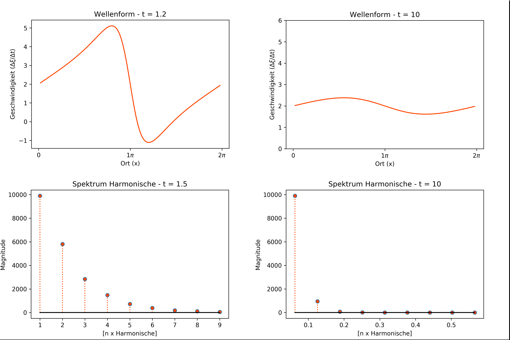 \\
   Zusätzliche Frequenzen werden erzeugt! \\
   Starke Dämpfung der Schwingung.
  
* Anwendung der Nichtlinearität
  Eintonmodulation von zwei Schwingungen.
** Ultraschall zu Hörschall
  #+ATTR_ORG: :width 200px :height 200px
  #+ATTR_HTML:  image :title Virtuelle Schallquelle :align center :width 60% :height 60%
  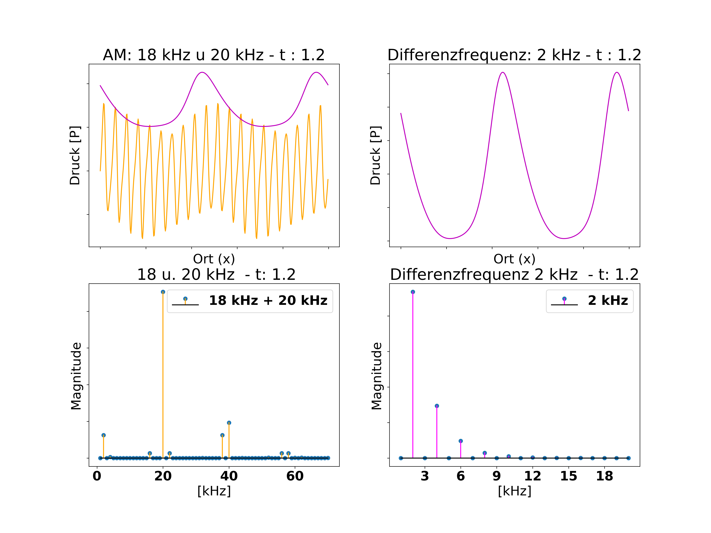 \\
  Bildung einer hörbaren Schwingung.

*** Ursache der Differenzfrequenz
  #+ATTR_ORG: :width 200px :height 200px
  #+ATTR_HTML:  image :title Demodulation des Signals :align center :width 60% :height 60%  
  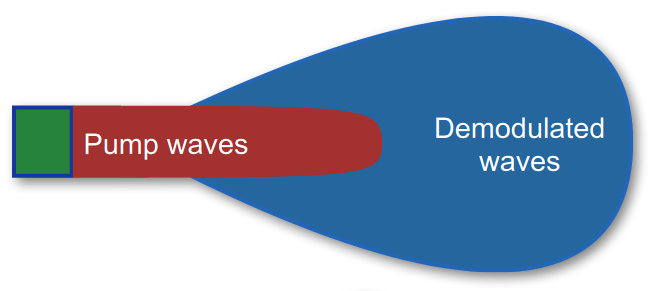 \\
  In der Luft existieren zwei Felder:
   - Ein Feld mit nichtlinearer Interaktion
   - Ein linear akustisches Feld
*** Anwendungsmöglichkeit
 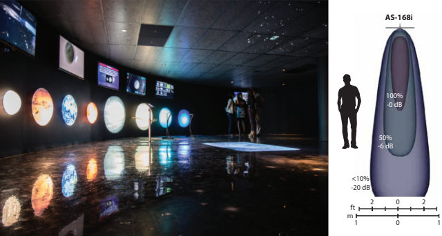 \\
Gezielte Beschallung von Bereichen im Raum.

* Fazit
  Nichtlineares Verhalten der Luft bei Ultraschall kann für 
 für *besondere* hörakustische Anwendungen nutzbar gemacht werden.\\
  \\
  
* Danke für die Aufmerksamkeit
  #+ATTR_ORG: :width 200px :height 200px
  #+ATTR_HTML:  image :title Museum Holosonic-Lautsprecher :align center :width 70% :height 70%
  
** Weiterführende Links
[[https://github.com/pvanberg/DGFEM-Acoustic][Framework für Schallausbreitung]] \\
[[https://www.egr.msu.edu/~fultras-web/][Matlab-plugin für Ultraschall]] \\
[[https://www.holosonics.com/][Hersteller von Richt-Lautsprechern]] \\
[[https://iopscience.iop.org/article/10.1088/1742-6596/1075/1/012035/pdf][Modulationstechniken für ein Array]] \\
[[http://perso.univ-lemans.fr/~vtournat/wa_files/NLALectureVT.pdf][Einleitung Nichtlineare Akustik]] \\
[[https://www.homemade-circuits.com/making-ultrasonic-directive-speaker/][Workshop Parametric Speaker]] \\

Bei weiteren Fragen: \\
hermannschris@googlemail.com

* Quellen
  [[https://hackaday.com/2019/02/14/creating-coherent-sound-beams-easily/][Page 2]]: Bryan Cockfield(2019) - Creating Coeherent Sound Beams, Easily aberufen 24.02.20 \\
  [[https://www.haustechnikdialog.de/SHKwissen/Images/Infraschall-Ultraschall.jpg][Page 5]]: HausTechnik Dialog - Lärm abgerufen 30.01.20 \\
  *Page 6*:  Dirk Olszweksi (2008) - Stark gerichtete Audio-Beschallung mit parametrischem Ultrschall-Lautsprecher P. 28 \\
#+REVEAL:split
  [[https://github.com/shosh1n/pde_sine_characteristic/blob/master/SchwebungAlles.ipynb][Page 9]]:  Christoph-A. Hermanns 2020 Python 3.7.4 - Schwebung\\ 
  *Page 13*:  Dirk Olszweksi (2008) - Stark gerichtete Audio-Beschallung mit parametrischem Ultrschall-Lautsprecher P. 28 \\
  [[https://github.com/shosh1n/pde_sine_characteristic/blob/master/VeloUp.ipynb][Page 14]]: Christoph-A. Hermanns 2020 Python 3.7.4 - VeloUp\\ 
  [[https://github.com/shosh1n/pde_sine_characteristic/blob/master/DiffuseB1.ipynb][Page 15]]: Christoph-A. Hermanns 2020 Python 3.7.4 - DiffuseB1(Burgers)\\
  #+REVEAL:split
  [[https://github.com/shosh1n/pde_sine_characteristic/blob/master/AdditionBurgers.ipynb][Page 17]]: Christoph-A. Hermanns Python 3.7.4 -  AdditionBurgers\\
  [[http://perso.univ-lemans.fr/~vtournat/wa_files/NLALectureVT.pdf][Page 18]]: Vincent Tournat (2014) - Introductory Lecture on Nonlinear Acoustics\\
  [[https://www.holosonics.com/brochure-web-museum-galleries][Page 19]]: Holosonics - Museums & Galleries 30.01.20 \\
  [[https://www.youtube.com/watch?v=lk7PVZYS_TQ][Page 21]]: Holosonics - YouTube abgerufen 24.02.20
